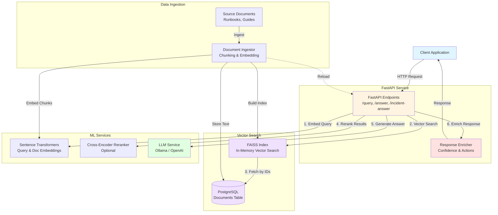

# Enterprise RAG Agent - Architecture Diagram

This diagram shows the overall system components and their interactions.

## Components

### FastAPI Service
- **API Endpoints**: Handles `/query`, `/answer`, and `/incident-answer` requests
- **Response Enricher**: Adds confidence scores and recommended actions for incident response queries

### Vector Search
- **FAISS Index**: In-memory vector index for fast similarity search
- **PostgreSQL**: Persistent storage for document chunks with metadata

### ML Services
- **Embedder**: Sentence-transformers model for generating embeddings
- **Reranker**: Optional cross-encoder for improving retrieval quality
- **LLM**: Ollama (local) or OpenAI for answer generation

### Data Ingestion
- **Ingestor**: Processes documents, splits into chunks, generates embeddings
- **Source Documents**: Runbooks, troubleshooting guides, architecture docs

## Data Flow

1. **Ingestion** (offline): Documents → Chunking → Embedding → Storage (Postgres + FAISS)
2. **Query** (runtime): Query → Embedding → FAISS Search → Postgres Fetch → Rerank → LLM Generation → Enrichment → Response
