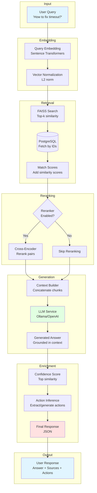

# Enterprise RAG Agent - Data Flow Diagram

This document shows the data flow for both the ingestion and query pipelines.

## Ingestion Pipeline

The ingestion pipeline processes source documents and builds the knowledge base.

```mermaid
flowchart LR
    subgraph Input
        A[Source Documents<br/>Runbooks, Guides,<br/>Architecture Docs]
    end
    
    subgraph Processing
        B[Document Loader<br/>Read files from disk]
        C[Text Splitter<br/>Chunk into segments]
        D[Metadata Extraction<br/>Title, source, etc]
    end
    
    subgraph Embedding
        E[Sentence Transformers<br/>Generate embeddings]
        F[Normalize Vectors<br/>L2 normalization]
    end
    
    subgraph Storage
        G[(PostgreSQL<br/>Store chunks + metadata)]
        H[FAISS Index<br/>Build vector index]
        I[Disk Persistence<br/>index.bin]
    end
    
    subgraph Reload
        J[API Reload Endpoint<br/>/faiss/reload]
    end
    
    A -->|Read| B
    B -->|Parse| C
    C -->|Extract| D
    D -->|Text chunks| E
    E -->|Embed| F
    F -->|Vectors + Text| G
    F -->|Vectors + IDs| H
    H -->|Save| I
    G -.->|Optional trigger| J
    I -.->|Load into memory| J
    
    style A fill:#e1f5ff
    style G fill:#f0e1ff
    style H fill:#f0e1ff
    style I fill:#f0e1ff
    style E fill:#e1ffe1
```



### Ingestion Steps

1. **Document Loading**: Read source files from `data/samples/`
2. **Text Splitting**: Break documents into chunks (~500-1000 tokens)
3. **Metadata Extraction**: Extract title, filename, section headers
4. **Embedding Generation**: Convert text to 768-dim vectors using sentence-transformers
5. **Vector Normalization**: Normalize for cosine similarity
6. **Database Storage**: Store chunks with metadata in PostgreSQL `documents` table
7. **Index Building**: Build FAISS index from embeddings and document IDs
8. **Persistence**: Save FAISS index to `data/faiss/index.bin`
9. **Reload**: Optionally trigger API to reload index into memory

### Data Transformation

```
Raw Document (Markdown/Text)
    ↓
Chunks (List[str])
    ↓
Embeddings (List[vector[768]])
    ↓
Database Rows (id, title, text, embedding)
    ↓
FAISS Index (vector → id mapping)
```

---

## Query Pipeline

The query pipeline retrieves relevant information and generates answers.



### Query Steps

1. **Query Reception**: User submits query via `/incident-answer` endpoint
2. **Query Embedding**: Convert query text to 768-dim vector
3. **Vector Normalization**: Normalize for cosine similarity search
4. **FAISS Search**: Find top-k most similar document vectors
5. **Database Fetch**: Retrieve full text chunks from PostgreSQL by document IDs
6. **Score Matching**: Add similarity scores to retrieved documents
7. **Reranking** (optional):
   - If enabled: Use cross-encoder to re-score query-document pairs
   - If disabled: Use FAISS scores as-is
8. **Context Building**: Concatenate top chunks within max character limit
9. **LLM Generation**: Generate answer grounded in retrieved context
10. **Confidence Calculation**: Use top similarity score (0.0-1.0)
11. **Action Inference**: Extract recommended actions from answer or apply heuristics
12. **Response Assembly**: Combine all elements into final JSON response
13. **Return to User**: Send enriched response

### Data Transformation

```
Query Text (str)
    ↓
Query Embedding (vector[768])
    ↓
FAISS Results (List[id, score])
    ↓
Document Chunks (List[{id, title, text, similarity}])
    ↓
Reranked Chunks (List[{id, title, text, score}])
    ↓
Context String (str, < 4000 chars)
    ↓
LLM Answer (str)
    ↓
Enriched Response ({query, summary, sources, confidence, recommended_actions})
```

---

## Data Storage Schema

### PostgreSQL `documents` Table
```
id              : SERIAL PRIMARY KEY
title           : TEXT
text            : TEXT
source          : TEXT
chunk_index     : INTEGER
embedding       : VECTOR(768)  -- pgvector type
created_at      : TIMESTAMP
```

### FAISS Index Structure
- **Type**: IndexFlatIP (Inner Product for cosine similarity)
- **Dimension**: 768
- **Size**: ~4KB per document
- **Location**: `data/faiss/index.bin`

### In-Memory Data
- FAISS index loaded at API startup
- Document text stored in PostgreSQL (not in memory)
- Reranker model loaded on-demand if enabled

---

## Performance Characteristics

### Ingestion Pipeline
- **Speed**: ~1-5 docs/second depending on size
- **Bottleneck**: Embedding generation (GPU accelerated if available)
- **Output**: ~1MB index per 1000 documents

### Query Pipeline
- **FAISS Search**: < 10ms for 10k documents
- **Database Fetch**: 10-50ms
- **Reranking**: +200-500ms if enabled
- **LLM Generation**: 1-5s depending on model
- **Total**: ~1-6s end-to-end
