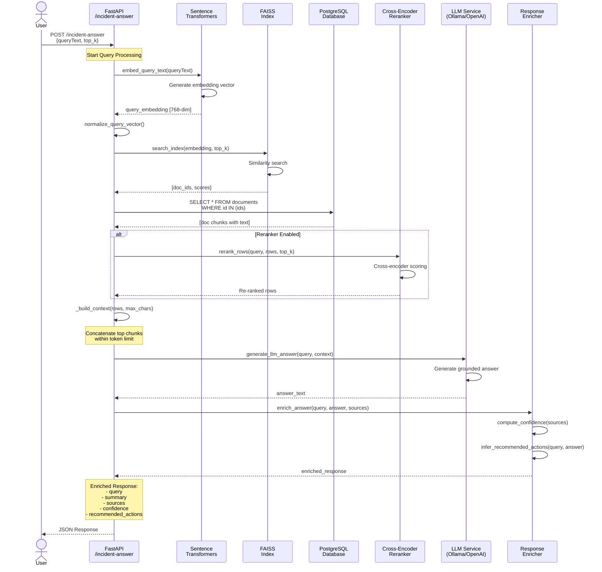

# Enterprise RAG Agent - Sequence Diagram

This diagram shows the step-by-step flow for the `/incident-answer` endpoint.

## Flow Description

### 1. Query Reception
- User sends incident query to `/incident-answer` endpoint
- Includes query text and optional `top_k` parameter

### 2. Query Embedding
- Convert query text to vector using sentence-transformers
- Normalize the embedding vector for cosine similarity

### 3. Vector Search
- Search FAISS index for top-k similar document chunks
- Returns document IDs and similarity scores

### 4. Document Retrieval
- Fetch full document chunks from PostgreSQL by IDs
- Preserves order from FAISS results

### 5. Reranking (Optional)
- If enabled, use cross-encoder to re-score query-document pairs
- More accurate but slower than initial retrieval

### 6. Context Building
- Concatenate top-ranked chunks into context string
- Respects maximum character limit to fit LLM context window

### 7. Answer Generation
- Send query + context to LLM (Ollama or OpenAI)
- LLM generates grounded answer based on retrieved context

### 8. Response Enrichment
- **Confidence Score**: Based on top similarity score
- **Recommended Actions**: Extracted from answer or generated via heuristics
  - For timeout incidents: retry, check health, increase timeout
  - For file download failures: verify file, retry download
  - Generic fallbacks for other cases

### 9. Return Response
- Return enriched JSON with all metadata to user
- User receives actionable incident response guidance

## Timing Considerations

- **Fast Path** (FAISS only): ~100-300ms
- **With Reranker**: +200-500ms additional
- **LLM Generation**: +1-5s depending on provider and model
- **Total**: ~1-6s end-to-end
